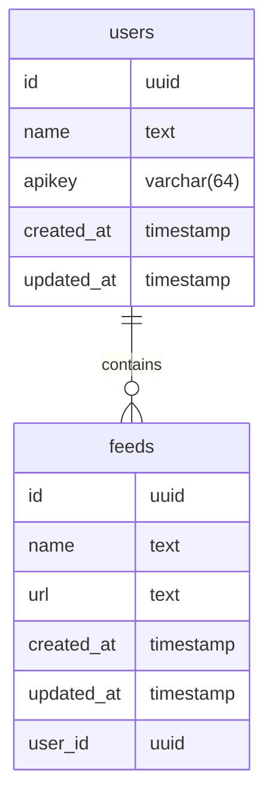

# GOLANG SCRATCH

<!--toc:start-->

- [GOLANG SCRATCH](#golang-scratch)
  - [tech and tools](#tech-and-tools)
  - [database](#database)
  <!--toc:end-->

## tech and tools

- chi router
- cors
- handlerWithJson
- commitlint & linter
- database
  - goose
  - sqlc
- docker
- auth
  - apikey
- relationship

## database

